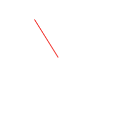

# Desktop Clock

<p align="center"></p>

A **frameless** analog clock for any Linux desktop. Transparent PNG faces
keep their alpha — no plate, no window chrome. Drop in a logo or a photo
as the clock face.



## Install

Python 3, GTK 3, PyGObject, cairo.

```bash
git clone https://github.com/burnt1983/desktop-clock.git
cd desktop-clock
./install.sh
desktop-clock --desklet
```

| Command | What you get |
|---|---|
| `desktop-clock --desklet` | Gadget on the desktop (all workspaces, no taskbar) |
| `desktop-clock --panel` | Compact chip you can sit by the panel |

**GNOME / MATE / XFCE / Budgie / LXQt / KDE:** the GTK window *is* the desklet. Add the `.desktop` to the panel as a launcher for the panel form.

**Cinnamon:** Settings → Desklets → Desktop Clock, or Applets for the panel chip.

## Options (right-click)

- Second hand
- Digital time underneath
- 12 / 24 hour
- Tick marks
- Transparent background (no frame)
- **Choose face image / logo** — PNG with transparency works best (SVG/JPEG too)
- Scroll to resize

Settings live in `~/.config/linux-desktop-clock/`.

## Licence

MIT. See [LICENSE](LICENSE).
